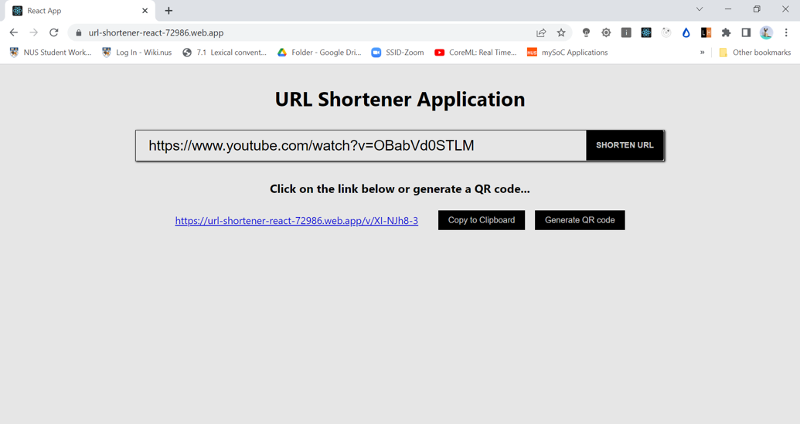

# URL Shortener Application using React And Firebase

## Introduction
This is an URL shortener application, designed and implemented using React and Firebase. The purpose of the application is to generate a shortened URL given a normal valid URL, that will arrive at the full URL without further clicks.

This project was bootstrapped with [Create React App](https://github.com/facebook/create-react-app).

## Features
- Allows users to enter a normal URL and generates a corresponding shorter URL, that will arrive at the full URL without further clicks
- Along with displaying the shorter URL, also has a button for users to copy the generated shortened URL to the clipboard
- Also comes with a QR code (which stores the shortened URL) that users can scan to access the full URL without any further actions
- Deployed real-time using Firebase

## Deployment
To access the application online, please click [here](https://url-shortener-react-72986.web.app/)

## Demonstration
To view a demonstration of the application, please click [here](https://www.youtube.com/watch?v=6HFjeQhXnCw)

## Pseudocode
1. The application will first displays the homepage where users have to enter a URL and click the respective button to generate a shortened URL.
2. The application will then verify whether the specified URL is valid. If the specified URL is invalid, the application generates an alert box with the respective message.
3. If the specified URL is valid, the application generates a corresponding unique ID and save the original URL and the unique ID in the firebase database. Then, the application will append the unique ID with hostname. This would be the shortened URL generated. The application will then, display the shortened URL, along with a button for users to copy the generated shortened URL to the clipboard and lastly a QR code that stores this shortened URL (for users to scan).
4. When users key in the generated shortened URL, the application will first extract the unique ID and make a query in the database to search for the corresponding original URL. If the original URL exists, the application will redirect to the respective original URL. Else, the application redirects to the homepage.

## Node Libraries Used
- "react-dom": to create routes
- "firebase": to use firebase as backend database

## Available Scripts

In the project directory, you can run:

### `npm start`

Runs the app in the development mode.\
Open [http://localhost:3000](http://localhost:3000) to view it in your browser.

The page will reload when you make changes.\
You may also see any lint errors in the console.

### `npm run build`

Builds the app for production to the `build` folder.\
It correctly bundles React in production mode and optimizes the build for the best performance.

The build is minified and the filenames include the hashes.\
Your app is ready to be deployed!

See the section about [deployment](https://facebook.github.io/create-react-app/docs/deployment) for more information.

### `npm run eject`

**Note: this is a one-way operation. Once you `eject`, you can't go back!**

If you aren't satisfied with the build tool and configuration choices, you can `eject` at any time. This command will remove the single build dependency from your project.

Instead, it will copy all the configuration files and the transitive dependencies (webpack, Babel, ESLint, etc) right into your project so you have full control over them. All of the commands except `eject` will still work, but they will point to the copied scripts so you can tweak them. At this point you're on your own.

You don't have to ever use `eject`. The curated feature set is suitable for small and middle deployments, and you shouldn't feel obligated to use this feature. However we understand that this tool wouldn't be useful if you couldn't customize it when you are ready for it.

